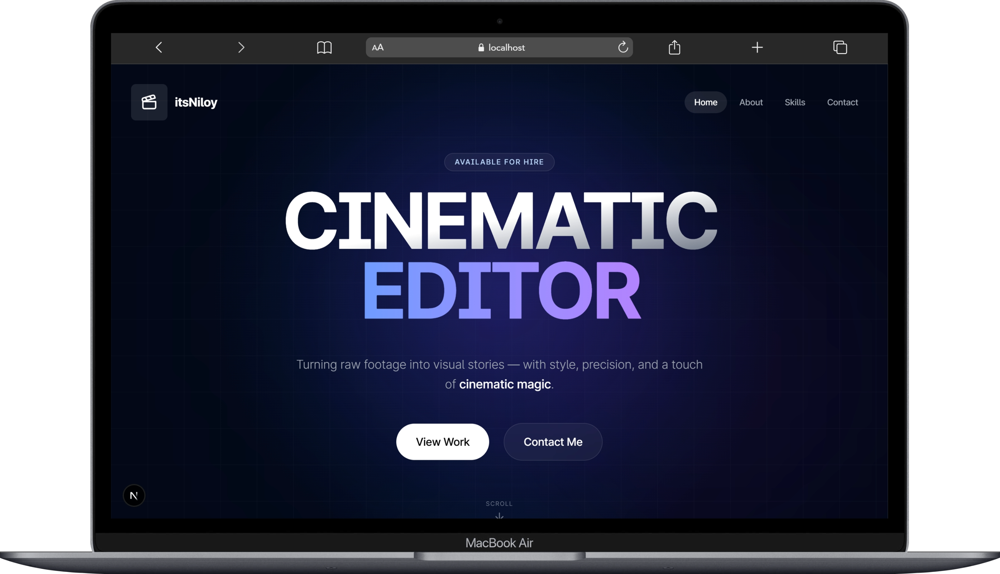

# Ahmad Dawar | Video Editor & Motion Designer

<div align="center">



### Cinematic & Modern Video Portfolio
*A premium, responsive portfolio for showcasing professional video editing and motion graphics.*

[](https://reactjs.org/)
[](https://vitejs.dev/)
[](https://www.typescriptlang.org/)
[](https://tailwindcss.com/)
[](https://www.framer.com/motion/)

[**🌐 Live Portfolio**](https://github.com/dawarahmadjan-ship-it/Portfolio)

</div>

## ✨ About the Portfolio

This portfolio is designed with a **"Midnight Liquid Glass"** aesthetic, emphasizing depth, motion, and clarity. It serves as a visual hub for my professional video editing work, including Vlogs and Short-form content.

-   **Glassmorphism Effects**: Premium `backdrop-blur` components for a sleek, modern feel.
-   **Dynamic Gallery**: Responsive grid supporting both standard (16:9) and vertical (9:16) video aspect ratios.
-   **Interactive Previews**: Instant YouTube video expansion for seamless viewing.
-   **Skill Showcase**: Detailed breakdown of technical expertise and creative workflow.
-   **Functional Contact**: Integrated with **Web3Forms** for direct client inquiries.

## 🚀 Getting Started

### Prerequisites

- Node.js 18+
- npm or pnpm

### Installation

1.  **Clone the repository**
    ```bash
    git clone https://github.com/dawarahmadjan-ship-it/Portfolio.git
    cd Portfolio
    ```

2.  **Install dependencies**
    ```bash
    npm install
    ```

3.  **Run the development server**
    ```bash
    npm run dev
    ```

4.  **Open your browser**
    Navigate to [http://localhost:5173](http://localhost:5173)

## 📂 Project Structure

```plaintext
📦 Ahmad-Portfolio
 ┣ 📂 public
 ┃ ┣ 📂 project-images
 ┃ ┣ 📂 tools
 ┃ ┣ 📜 ahmadpic.jpg      # Profile Picture
 ┃ ┣ 📜 demo.png          # SEO Banner
 ┃ ┗ 📜 favicon.ico
 ┣ 📂 src
 ┃ ┣ 📂 components        # Reusable UI Components
 ┃ ┃ ┣ 📂 ui              # Shadcn/ui & Primitive Components
 ┃ ┃ ┣ 📜 navbar.tsx
 ┃ ┃ ┣ 📜 footer.tsx
 ┃ ┃ ┗ 📜 project-card.tsx
 ┃ ┣ 📂 db                # Data handling
 ┃ ┃ ┣ 📜 projects.ts     # Video Project Database
 ┃ ┃ ┗ 📜 skills.ts       # Skills & Achievements
 ┃ ┣ 📂 pages             # Application Views
 ┃ ┃ ┣ 📜 Home.tsx
 ┃ ┃ ┣ 📜 About.tsx
 ┃ ┃ ┣ 📜 Skills.tsx
 ┃ ┃ ┗ 📜 Contact.tsx
 ┃ ┣ 📂 lib               # Utility functions
 ┃ ┣ 📂 types             # TypeScript Definitions
 ┃ ┣ 📜 App.tsx           # Main Router
 ┃ ┗ 📜 main.tsx          # Entry point
 ┣ 📜 index.html
 ┣ 📜 package.json
 ┗ 📜 vite.config.ts
```

## 🛠️ Tech Stack

-   **Framework**: React 18 with Vite
-   **Styling**: Tailwind CSS
-   **Animations**: Framer Motion
-   **Icons**: Lucide React
-   **Form Handling**: Web3Forms

---

<div align="center">
Created with ❤️ by Ahmad Dawar
</div>
